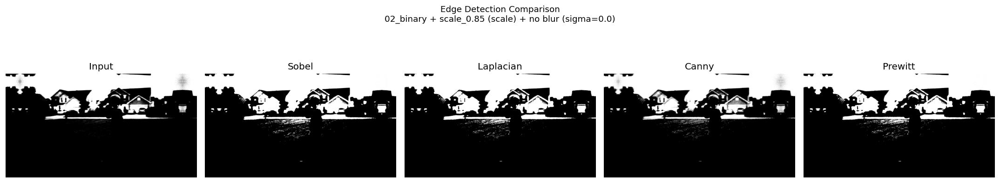
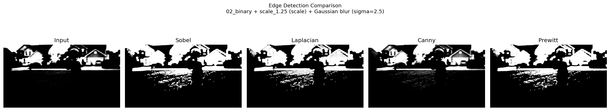
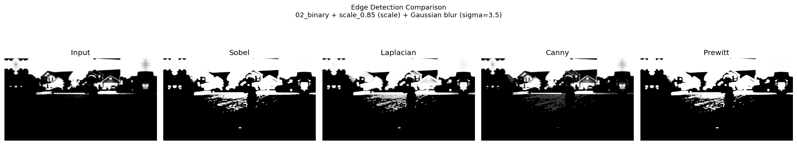
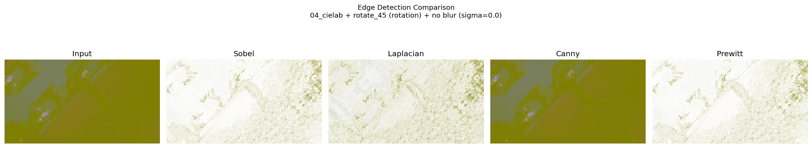
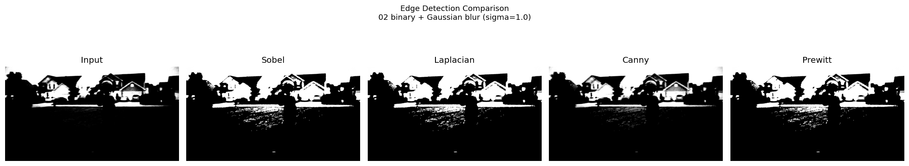
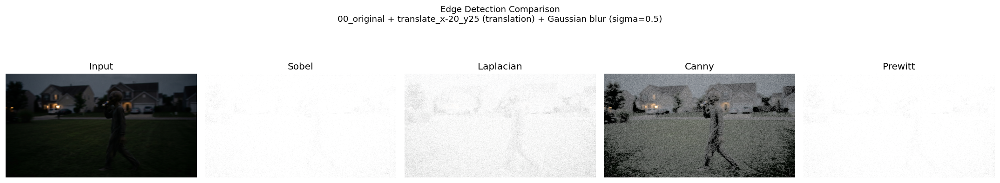
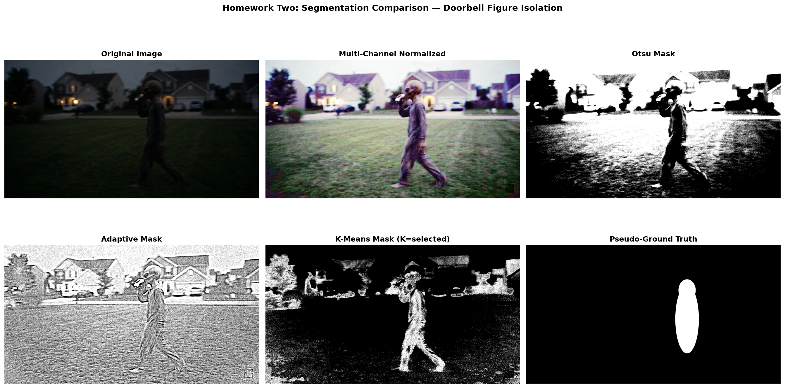

# LohithaMovva-CS898BA-Project1

CS 898BA – Image Analysis and Computer Vision  
Homework One: Doorbell “Alien” Image Analysis · Homework Two: Image Segmentation

This repository contains a Python/OpenCV pipeline that analyzes, transforms, blurs, and edge-detects a low-light doorbell camera image (`HW1_IMG_CS898BA.png`), and segments the central figure using classical thresholding and K-Means clustering (Homework Two, branch `Feature-Segmentation`).

## Project Structure

```
LohithaMovva-CS898BA-Project1/
├── hello_world.py              # Initial Hello World script
├── requirements.txt            # Python dependencies
├── AI_Log.md                   # AI usage log (course requirement)
├── README.md                   # This file
├── data/
│   ├── HW1_IMG_CS898BA.png     # Input image
│   └── ground_truth_mask.png   # HW2 pseudo-ground-truth mask (manual)
├── src/
│   ├── part2_processing.py           # HW1 Part 2: stats, color spaces, affine, blur
│   ├── part3_edge_detection.py       # HW1 Part 3: subsets, edge detection, plots
│   ├── hw2_part2_normalization.py    # HW2 Part 2: multi-channel histogram equalization
│   ├── hw2_part3_threshold.py        # HW2 Part 3: Otsu + adaptive thresholding
│   ├── hw2_part4_kmeans.py           # HW2 Part 4: HSV K-Means clustering
│   └── hw2_part5_evaluation.py       # HW2 Part 5: IoU/Dice metrics + comparison plot
└── output/
    ├── part2/                  # HW1: 7 base + 14 affine + 168 blur outputs
    ├── part3/                  # HW1: 210 edge-detection outputs + 42 comparison plots
    ├── hw2/                    # HW2: normalization, threshold, k-means, evaluation outputs
    └── readme_plots/           # Sample plots for this README
```

## Setup

1. Clone this repository.
2. Create and activate a virtual environment:

```bash
python3 -m venv .venv
source .venv/bin/activate   # macOS/Linux
```

3. Install dependencies:

```bash
pip install -r requirements.txt
```

## Execution

Run the scripts in order:

```bash
python hello_world.py
python src/part2_processing.py
python src/part3_edge_detection.py
```

### Expected Output Counts

| Stage | Description | Count |
|-------|-------------|-------|
| Part 2 base | Original + grayscale + binary + HSV + CIELAB + HLS + HSV-V-equalized RGB | 7 |
| Part 2 affine | 2 unique transforms per base image | 14 |
| Part 2 total pre-blur | Base + affine | 21 |
| Part 2 blur | Each of 21 images at sigma 0.0 (no blur) + 7 blur levels | 168 |
| Part 3 subsets | 4 random subsets of 42 images | 168 total split |
| Part 3 selected | Subset 0 used for edge detection | 42 |
| Part 3 edges | 42 before + 42×4 edge overlays | 210 |
| Part 3 plots | 42 comparison plots; 6 copied to `output/readme_plots/` | 42 / 6 |

## Part 2: Image Processing

### Channel Statistics (Original BGR Image)

| Statistic | Blue | Green | Red |
|-----------|------|-------|-----|
| Min | 0 | 0 | 0 |
| Max | 255 | 255 | 255 |
| Average | 21.83 | 24.64 | 20.61 |
| Median | 10.0 | 16.0 | 12.0 |
| Mode | 4 | 10 | 4 |
| Skew | 1.68 | 1.76 | 2.11 |
| Range | 255 | 255 | 255 |
| Std Dev | 26.23 | 22.23 | 22.46 |
| Variance | 687.99 | 493.96 | 504.26 |

The image is heavily underexposed: all channels have low means (≈21–25), medians near the dark end, and positive skew (long bright tails from porch lights and windows). The blue channel has the highest variance, consistent with the cool color cast in the night scene.

### Color Space Conversions

- **Grayscale**: Luminance compression for single-channel analysis.
- **Binary**: Otsu automatic threshold on grayscale.
- **HSV / HLS / CIELAB**: Alternative decompositions for lighting and color analysis.
- **HSV V-channel equalization**: Histogram equalization on the Value channel improves visibility in shadow regions, then conversion back to BGR.

### Affine Transformations

Each of the 7 base images receives 2 unique affine transforms (14 total): translation, rotation (90°, 186°, 45°, 270°), scaling (0.85, 1.25, 0.65), and shear. No two transforms share the same type and parameters.

### Gaussian Blur Discussion

Sigma controls blur strength. For this doorbell image:

- **σ = 0.5–1.0**: Fine detail (grass texture, figure outline) remains visible; noise is slightly reduced.
- **σ = 1.5–2.0**: Moderate smoothing; figure silhouette stays recognizable but high-frequency noise in the lawn decreases.
- **σ = 2.5–3.5**: Heavy blur; edges merge, small structures disappear, and the scene looks foggy. At σ = 3.5 the “alien” figure becomes a soft blob, which would hurt edge-based detection.

Higher sigma increases low-pass filtering, trading detail for noise suppression.

## Part 3: Edge Detection

### Subset Selection

All 168 blurred images are shuffled (seed = 898) and split into 4 subsets of 42. **Subset 0** is used for the remaining analysis.

### Edge Detection Methods

| Method | Pros | Cons |
|--------|------|------|
| **Sobel** | Fast first-derivative operator; approximates gradient magnitude; good directional sensitivity | Sensitive to noise; produces thick edge responses in dark noisy regions |
| **Laplacian** | Detects edges in all directions via second derivative; simple to implement | Very noise-sensitive; double edges; no gradient direction |
| **Canny** | Multi-stage (Gaussian smooth → gradient → NMS → hysteresis); thin, connected edges; low false-positive rate | Requires threshold tuning; may miss weak edges in very dark areas |
| **Prewitt** | Similar to Sobel with simpler kernels; intuitive gradient estimate | Comparable noise sensitivity to Sobel; slightly less smoothing than Sobel’s 3×3 weighted kernel |

### Quantitative Comparison (Subset 0, average edge pixel density)

| Method | Avg Edge Density | Std Dev |
|--------|------------------|---------|
| Sobel | 0.688 | 0.364 |
| Prewitt | 0.688 | 0.364 |
| Laplacian | 0.628 | 0.338 |
| Canny | 0.083 | 0.116 |

### Best Method for This Image Set

**Canny works best** for this low-light, noisy doorbell scene, even though it is not the densest detector.

Sobel and Prewitt report ~68% of pixels as edges because the dark lawn and sensor noise produce strong gradient responses everywhere—not because they find the figure more accurately. Laplacian behaves similarly as a high-pass operator amplified by noise.

Canny’s Gaussian pre-smoothing, non-maximum suppression, and hysteresis thresholding yield sparse, coherent contours that trace the figure and house geometry without flooding the image with grass noise. The trade-off is that some weak shadow boundaries are suppressed, but the resulting edges are far more interpretable for identifying what is actually in the scene (likely a person in a costume rather than an alien).

For less noisy images, Sobel or Prewitt might be preferable for speed and simplicity. Here, Canny’s noise rejection is the decisive advantage.

## Sample Comparison Plots

Six randomly selected 5-panel plots (input + Sobel + Laplacian + Canny + Prewitt):

### Plot 1 — Binary image, scale 0.85, no blur


### Plot 2 — Binary image, scale 1.25, sigma 2.5


### Plot 3 — Binary image, scale 0.85, sigma 3.5


### Plot 4 — CIELAB image, rotate 45°, no blur


### Plot 5 — Binary image, sigma 1.0


### Plot 6 — Original, translate (−20, 25), sigma 0.5


## Discussion

The doorbell image is a challenging low-light capture: underexposure, cool color cast, motion blur on the figure, and high sensor noise in the lawn. Histogram equalization on the HSV V channel is the most useful preprocessing step for human inspection—it reveals the figure more clearly without claiming anything about extraterrestrial origin.

Edge detection confirms that simpler gradient operators over-segment noisy dark regions, while Canny provides cleaner structural boundaries. Combined with moderate Gaussian blur (σ ≈ 1.0–1.5) before edge detection, Canny would likely perform even better, though this assignment applies edge detectors directly to the subset images as specified.

---

## Homework Two: Image Segmentation

Branch: **`Feature-Segmentation`**

Run the Homework Two scripts in order (after HW1 setup):

```bash
python src/hw2_part2_normalization.py
python src/hw2_part3_threshold.py
python src/hw2_part4_kmeans.py
python src/hw2_part5_evaluation.py
```

### Part 2: Multi-Channel Normalization

The original BGR image is split into Blue, Green, and Red channels. Each channel receives independent histogram equalization (`cv2.equalizeHist`), then the channels are merged back into a fully normalized color image. Unlike Homework One’s single V-channel equalization, this normalizes illumination across the entire color spectrum and dramatically improves figure visibility before segmentation.

### Part 3: Threshold-Based Segmentation

On the normalized grayscale image:

- **Otsu’s global threshold** (automatic threshold = 129.0) separates bright vs. dark regions globally.
- **Adaptive Gaussian threshold** (block size 51, C = 8) adapts to local illumination.

Both methods save binary masks and masked foreground extractions under `output/hw2/part3/`.

### Part 4: K-Means Clustering (HSV)

The normalized image is converted to HSV and clustered with K-Means for K ∈ {3, 4, 5}. The cluster best overlapping the expected figure region (right-center lawn) is selected. **K = 5** (cluster 4) scored highest and was used as the final K-Means segmentation.

### Part 5: Qualitative Analysis

| Method | Pros | Cons |
|--------|------|------|
| **Otsu (normalized)** | Fast, parameter-free global split; improved contrast after multi-channel normalization reveals more structure than raw-image Otsu | Still treats lawn, sky, and figure as one intensity class; cannot isolate the figure; floods ~50% of pixels as foreground |
| **Adaptive (normalized)** | Handles local illumination (porch lights vs. dark lawn); preserves fine boundary detail | Extremely noise-sensitive on grass texture; produces fragmented “stippled” mask; figure merges with background edges |
| **K-Means (normalized)** | Uses full HSV color information; best figure isolation of the three methods; separates costume tones from grass and houses | Background speckle remains (leaves, driveway edges); cluster selection requires ROI heuristic; edges are blob-like rather than crisp |

**Impact of multi-channel normalization:** Homework One operated on the raw underexposed image (means ≈ 21–25 per channel). Multi-channel equalization boosts contrast in all color bands simultaneously, making the grey-purple costume and head distinguishable from the lawn. Raw-image Otsu achieves IoU = 0.021 vs. normalized Otsu IoU = 0.044—roughly 2× improvement—confirming that illumination normalization is a necessary preprocessing step, even though threshold methods alone still fail to cleanly isolate the figure.

### Part 5: Quantitative Comparison (Pseudo-Ground Truth)

A manual pseudo-ground-truth mask (`data/ground_truth_mask.png`) was defined using head + body ellipses traced over the figure in the normalized image.

| Method | IoU (Jaccard) | Dice Coefficient |
|--------|---------------|------------------|
| Otsu (normalized) | 0.0439 | 0.0841 |
| Adaptive (normalized) | 0.0377 | 0.0727 |
| K-Means (normalized) | **0.0635** | **0.1195** |
| Otsu (raw image, HW1 baseline) | 0.0209 | 0.0409 |

K-Means achieves the highest overlap with the reference mask. All absolute scores remain low because threshold methods classify large background regions as foreground, while the pseudo-ground-truth tightly encloses only the figure’s biomass region.

### Segmentation Comparison Plot

Side-by-side view: original image, multi-channel normalized image, Otsu mask, adaptive mask, K-Means mask, and pseudo-ground truth.



## Author

Lohitha Movva (Lohithamovva) — CS 898BA Project 1
